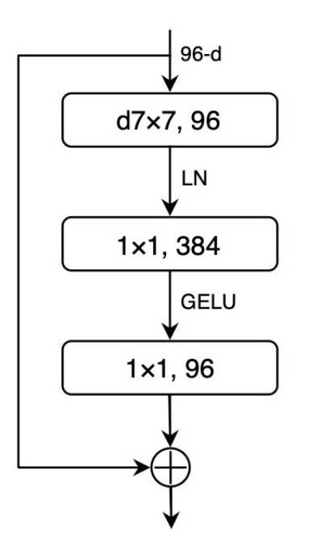
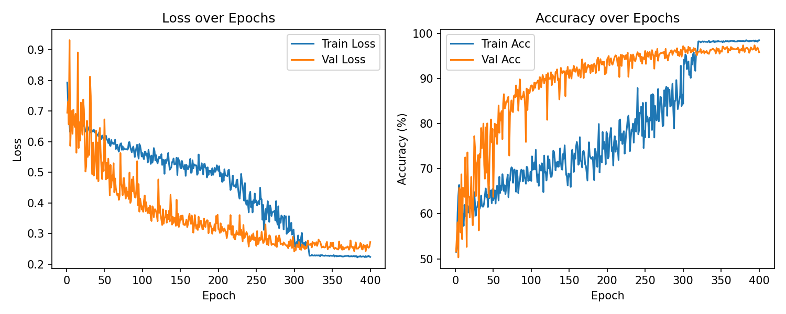
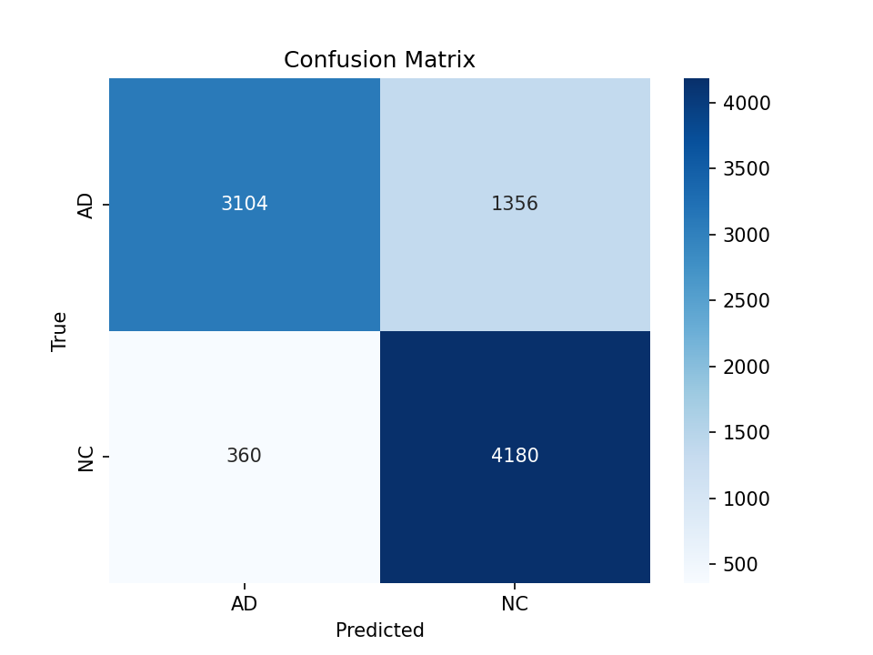

# ConvNeXt Alzheimer's Classification

PatternAnalysis-2025 | Recognition Project - Hard Difficulty
Author: s4938484 - Gia Hung Huynh

## Table of Contents

- [ConvNeXt Alzheimer's Classification](#convnext-alzheimers-classification)
  - [Table of Contents](#table-of-contents)
  - [Introduction](#introduction)
  - [Model Architecture](#model-architecture)
    - [ConvNeXtBlock Components](#convnextblock-components)
    - [The ConvNeXt architecture](#the-convnext-architecture)
    - [Adaptation for ADNI Dataset](#adaptation-for-adni-dataset)
    - [Summary of Differences from Pretrained ConvNeXt (TorchVision)](#summary-of-differences-from-pretrained-convnext-torchvision)
  - [Data Pre-processing and Dataset Splits](#data-pre-processing-and-dataset-splits)
    - [Overview](#overview)
    - [Pre-processing Steps](#pre-processing-steps)
    - [Data Splits](#data-splits)
  - [Training Process](#training-process)
  - [Result](#result)
  - [Usage](#usage)
    - [Clone the repository](#clone-the-repository)
    - [Install Dependencies](#install-dependencies)
    - [Directory structure](#directory-structure)
    - [Adjust Hyperparameters](#adjust-hyperparameters)
    - [Train the Model](#train-the-model)
  - [References](#references)

## Introduction

Alzheimer’s disease (AD) is a progressive neurodegenerative disorder characterized by structural brain changes visible in MRI scans.
The goal of this project is to classify MRI brain slices from the ADNI dataset into Alzheimer’s Disease (AD) or Cognitively Normal (CN) categories.

This project goal is to classify between Alzheimer's Disease (AD) and Normal Control (NC) images in the Alzheimer's Disease Neuroimaging Initiative (ADNI) brain dataset [[1]](#adni-link) and contributes to the open-source PatternAnalysis repository under the recognition branch. The desired test accuracy is 0.8, as specified in the requirement.

The model reaches a 0.80933 accuracy on the ADNI test dataset


## Model Architecture


### ConvNeXtBlock Components

Our model employs a custom reimplementation of the ConvNeXt architecture, built from scatch and tweaked to better suit the characteristics of the ADNI dataset. At the core of this design is the ConvNeXtBlock, which integrates several key components inspired by both convolutional and transformer-based architectures.
The ConvNeXt Block architecture is shown in [Figure 1](#convnext-block).

<a id="convnext-block"></a>



Figure 1. ConvNeXt block architecture, adapted from Liu et al. (2022) [[5]](#convnext).


### The ConvNeXt architecture

The original ConvNeXt architecture is shown in [Figure 2](#convnext-structure) .

<a id="convnext-structure"></a>


Figure 2. ConvNeXt architecture, adapted from GeeksforGeeks [[3]](#convnext-gfg).

In the original ConvNeXt, LayerNorm is used instead of BatchNorm but due to the small dataset at training time, BatchNorm has proven to be more suitable

Multiple ConvNeXtBlocks are sequentially stacked to form ConvNeXt stages. Between stages, we downsample with BatchNorm2d, then a strided Conv2d (k=2,s=2). We halve spatial size and double channels to build a hierarchical representation, similar to conventional CNN pyramids

- **Depthwise Convolution:** Eah block begins with a larger kernel of size 7x7, depthwise convolution to capture broad spatial context efficiently
- **Batch Normalization:** After the depthwise convolution, we apply BatchNorm2d in NCHW, which stabilizes training without switching layouts
- **Pointwise MLP (Multi-Layer Perceptron):** Two layer of 1x1 conv -> GELU -> 1x1 conv acts as a channel-wise MLP. Thus, enabling non-linear mixing.
- **LayerScale:** A learnable per-channel scale that modulate the residual branch to boost optimization stability in deep networks
- **DropPath (Stochastic Depth):** randomly drops entire residual branches during training. This structured dropout helps enhance model robustness.
- **Residual Connection:** The block sums the input with the transformed features to preserve information and ease gradient flow.

### Adaptation for ADNI Dataset

- **Input modality:** MRI slices are converted to grayscale and replicated to 3 channels to match ConvNeXt stem while keep the structure unchanged.
- **Augmentations for robustness:** Moderate geometric and photometric transforms
- **Optimization choices:** BN, LayerScale, DropPath are tuned for small dataset. schedule MixUp/CutMix are used during early/mid training has proven be of great benefit [[9]](#schedule-cutmix-mixup)


### Summary of Differences from Pretrained ConvNeXt (TorchVision)

| Aspect                      | Custom ConvNeXt Implementation                   | Pretrained ConvNeXt (TorchVision)                |
|-----------------------------|-------------------------------------------------|--------------------------------------------------|
| **Implementation**           | From scratch blocks | Official PyTorch implementation with pretrained weights on ImageNet |
| **Training Objectives**      | Alzheimer's (AD vs NC) with medical-specific regularization | General ImageNet classification |
| **Dataset Adaptation**       | 3 channel grayscale replication, MRI-oriented augmentations | Trained on natural images; requires fine-tuning for medical images |
| **Flexibility**              | Full control over layers/normalization/heads | Limited flexibility; mainly fine-tuning pretrained backbone |
| **Interpretability**         | Transparent design  and logits-level evaluation | Depend on fine-tuning setup |

**Rationale:** By reimplementing ConvNeXt from scratch,we have more control over normalization, block details and regularization tailored to ADNI, which then can transfer to natural image medical datasets more smoothly


## Data Pre-processing and Dataset Splits

### Overview 

The dataset used in this project is a subset of the **ADNI (Alzheimer’s Disease Neuroimaging Initiative)** MRI collection, provided by UQ via rangpur. 

Each image in the dataset is grayscale and have a resolution of `256 x 240` pixels. The filenames follow the format `patientID_index.png` where `patientID` identifies the patient and `index` is the image number.

The statistics of the dataset including the number of images and patients across the train and test sets for both classes are shown in Table 1

<a id="adni-table"></a>

| Dataset Split  | AD Images | NC Images | Total Images | Patients  |
|----------------|-----------|-----------|--------------|-----------|
| **Train**      | 10,400    | 11,120    | 21,520       | 1,076     |
| **Test**       | 4,460     | 4,540     | 9,000        | 450       |
| **Total**      | 14,860    | 15,660    | 30,520       | 1526      |

Table 1. ADNI dataset split statistics (images and patients).

Sample MRI image from the ADNI dataset for Alzheimer's Disease (AD) and Normal Control (NC) classes are shown below.

  
Alzheimer's Disease (AD)

  
Normal Control (NC)

### Pre-processing Steps

All MRI images are preprocessed before training. Images are resized to 224 x 224, converted to 3 channels to match input format of ConvNeXt and normalized using specific mean and standard deviation for each dataset. To enhance model's generalization and prevent overfitting, various data augmentation techniques are used:

1.	**Grayscale** (3-channel): converts images to grayscale and replicates to 3 channels so RGB-based models still work.
2.	**Random Resize Crop**: randomly crops and resizes to IMAGE_SIZE (zoom 80–100%) to improve scale/framing robustness.
3.	**Horizontal Flip** (p=0.5): mirrors left↔right half the time to reduce orientation bias.
4.	**Vertical Flip** (p=0.2): flips top↔bottom occasionally to handle vertical orientation variance.
5.	**Rotation** (±15°): rotates slightly to tolerate minor misalignment in acquisition.
6.	**Affine Transform**: applies small translate/zoom/shear to mimic positioning differences across scans.
7.	**Gaussian Blur**: lightly blurs with random strength to build resilience to focus/quality variations.
8.	**To Tensor**: converts the PIL image to a PyTorch tensor scaled to [0, 1] for model input.
9.	**Gaussian Noise**: adds low-level random noise to improve robustness to sensor noise.
10. **Random Erasing** [[8]](#random-erasing) (p=0.25): masks a random patch to encourage occlusion tolerance and feature reliance following the ConvNeXt Paper [[[5]]] .
11. **Normalize** (mean/std): standardizes channels for stable training and faster convergence.


### Data Splits
- **Training:** 90% of images from each class (AD and NC).  
- **Validation:** 10% of images from the training folder, held out for model selection and early stopping.  
- **Test:** A separate unseen folder (`AD_NC/test`) used only for final evaluation.  

This split ensures that the model’s generalisation is evaluated on entirely unseen data while maintaining class balance across subsets.

## Training Process

- The model was trained on the ADNI dataset using PyTorch framework. The model was trained for 400 epochs with early stopping based on validation loss to prevent overfitting. 
- The AdamW optimizer was used to improve training stability and reduce overfitting through weight decay. Regularization schemes such as Label Smoothing [[7]](#label-smoothing) and Drop Path [[4]](#drop-path) were used to improve generalization.
- Schedule CutMix and MixUp were also used during training to help preven overfitting and increase overall generalization [[9]](#schedule-cutmix-mixup)


#### Stochastic Weight Averaging (SWA)

We adopt **Stochastic Weight Averaging (SWA)** in the final phase of training to improve generalization. SWA maintains a running average of model weights sampled near the end of training (here: starting at **80%** of epochs) and evaluates the averaged model at test time. This simple change nudges the solution toward a **wider/flatter optimum**, which is linked to better out-of-distribution robustness and smoother loss/accuracy curves [[10]](#swa-izmailov), [[12]](#swa-blog). In our PyTorch implementation we use `torch.optim.swa_utils.AveragedModel` and perform a one-pass **BatchNorm statistics update** with `torch.optim.swa_utils.update_bn(train_loader, swa_model)` before saving/evaluating the SWA weights [[11]](#swa-averagedmodel).

The main hyperparameters used in the training process are summarized in [Table 2](#hyperparameters)

<a id="hyperparameters"></a>

| **Hyperparameter**            | **Value**                             |
| ------------------------------| --------------------------------------|
| Optimizer                     | AdamW                                 |
| Learning Rate                 | 1e-3                                  |
| Learning Rate Scheduler       | CosineAnnealingLR                     |
| Warmup epochs                 | 5                                     |
| Weight Decay                  | 0.05                                  |
| Batch Size                    | 512                                   |
| Epochs                        | 400                                   |
| Mixup initial                 | 0.8                                   |
| CutMix initial                | 1.0                                   |
| Mixup probability             | 1.0                                   |
| Explore end epoch             | 50%                                   |
| Transition end epoch          | 75%                                   |
| Mixup initial                 | 0.8                                   |
| SWA start epochs              | 80%                                   |
| Drop Path                     | 0.1                                   |
| Label Smoothing               | 0.1                                   |
| Loss Function                 | CrossEntropyLoss                      |

Table 2. Summary of hyperparameters and training configuration.


## Result

The training and validation loss recorded for each epoch are shown in [Figure 3](#training-curves). The model was trained for 400 epochs, and the best model was selected at epoch 390, where it got the lowest validation loss. 
The massive difference between the train and validate data in the early to mid epochs is actually a normal behavior of CutMix and Mixup usage as they mix samples and create a newer picture for the model to train from. 
After the Explore end epochs (50%), we can see that the curves are beginning to smoothen up and model is actually very stable.
And in the last 25% epochs (transition end epochs), which starts at around epoch 320 in this case, train loss and accuracy actually improved significantly because both Mixup and CutMix are turned off.

<a id="training-curves"></a>


Figure 3. Training and Validation Loss Curves

To evaluate the model's performance on unseen data, the test set was used. The model achieved a overall **test accuracy of 0.809**, each class's precision and recall accuracy, F1 score and support are shown in [Table 3](#classification_report)

<a id="classification_report"></a>

| Class        | Precision           | Recall              | F1-score            | Support |
|--------------|---------------------|---------------------|---------------------|---------|
| AD           | 0.8960739030023095  | 0.6959641255605381  | 0.7834427057041898  | 4460.0  |
| NC           | 0.755057803468208   | 0.920704845814978   | 0.8296943231441049  | 4540.0  |
| accuracy     | 0.8093333333333333  | 0.8093333333333333  | 0.8093333333333333  | 0.8093333333333333 |
| macro avg    | 0.8255658532352588  | 0.8083344856877581  | 0.8065685144241473  | 9000.0  |
| weighted avg | 0.8249391150151072  | 0.8093333333333333  | 0.8067740771683247  | 9000.0  |

Table 3. Classification Report


The confusion matrix for test results is shown in [Figure 4](#confusion-matrix). The results demonstate that ConvNeXt can effectively distinguish between AD and NC brain MRIs.

<a id="confusion-matrix"></a>



Figure 4. Test Set Confusion Matrix

The UMAP visualization in [Figure 5](#umap) shows separation between AD and NC embeddings. Even though the NC cluster is not as compact as AD, there are less overlaps of NC in AD than AD in NC. Indicating the model learned NC better.

<a id="umap"></a>


Figure 5. UMAP projection of test set feature embeddings.

These results show that the model performs well overall, with particularly strong recall suggesting a good sensitiviy in detecting positive cases.


## Usage

### Clone the repository

Clone the project from github

```
git clone https://github.com/hunghuynh1110/PatternAnalysis-2025.git
git checkout topic-recognition
cd ./recognition/convnext_alzheimer_49384848
```

### Install Dependencies
This project requires Python 3.9.0 so ensure it is installed before proceeding. Then install the required packages.

```
pip install -r requirements.txt
```

### Directory structure

The directory is assumed to follow this structure

```
convnext_alzheimer_49384848
├── AD_NC
│   ├── test
│   │   ├── 388206_78.jpeg
│   └── train
├── constants.py
├── Images
│   ├── Report
│   ├── ADNI
├── dataset.py
├── modules.py
├── notetrain.ipynb
├── predict.py
├── README.md
├── train.py
└── utils.py
```


### Adjust Hyperparameters
Key hyperparameters such as batch size, learning rate, number of epochs, or label smoothing can be modified in constants.py.

```
EPOCHS = 450
LEARNING_RATE = 4e-3
BATCH_SIZE = 256
LABEL_SMOOTHING = 0.1
```

### Train the Model

Run the training pipeline to start training the model
```
python train.py
```

This will:

- Load and preprocess the dataset.
- Train the ConvNeXt model.
- Save the best model checkpoint (`best_convnext.pth`, `swa_model`)
- Generate training/validation loss plots and confusion matrices

## References

<a id="adni-link"></a>[1] Alzheimer's Disease Neuroimaging Initiative (ADNI). [https://adni.loni.usc.edu](https://adni.loni.usc.edu/)

<a id="rand-augment"></a>[2] Cubuk, E. D., Zoph, B., Shlens, J., & Le, Q. V. (2020). *RandAugment: Practical automated data augmentation with a reduced search space*. In CVPR. [https://arxiv.org/abs/1909.13719](https://arxiv.org/abs/1909.13719)

<a id="convnext-gfg"></a>[3] GeeksforGeeks. *ConvNeXt Architecture Overview*. Available at: [https://www.geeksforgeeks.org/computer-vision/convnext/](https://www.geeksforgeeks.org/computer-vision/convnext/)

<a id="drop-path"></a>[4] Huang, G., Liu, Z., van der Maaten, L., & Weinberger, K. Q. (2017). *Densely Connected Convolutional Networks (DenseNet)*. In CVPR. [https://arxiv.org/abs/1608.06993](https://arxiv.org/abs/1608.06993)

<a id="convnext"></a>[5] Liu, Z., Mao, H., Wu, C. Y., Feichtenhofer, C., Darrell, T., & Xie, S. (2022). *A ConvNet for the 2020s*. In CVPR. [https://arxiv.org/abs/2201.03545](https://arxiv.org/abs/2201.03545)

<a id="batchnorm"></a>[6] Wu, Y., & Johnson, J. (2021). *Rethinking "Batch" in BatchNorm*. [https://arxiv.org/abs/2105.07576](https://arxiv.org/abs/2105.07576)

<a id="label-smoothing"></a>[7] Szegedy, C., Vanhoucke, V., Ioffe, S., Shlens, J., & Wojna, Z. (2016). *Rethinking the Inception Architecture for Computer Vision*. In CVPR. [https://arxiv.org/abs/1512.00567](https://arxiv.org/abs/1512.00567)

<a id="random-erasing"></a>[8] Zhong, Z., Zheng, L., Kang, G., Li, S., & Yang, Y. (2020). *Random Erasing Data Augmentation*. In AAAI. [https://arxiv.org/abs/1708.04896](https://arxiv.org/abs/1708.04896)

<a id="schedule-cutmix-mixup"></a>[9] Liu, Z., Wang, Z., Guo, H., & Mao, Y. (2023). Over-Training with Mixup May Hurt Generalization. In ICLR 2023. https://arxiv.org/abs/2303.01475

<a id="swa-izmailov"></a>[10] Izmailov, P., Podoprikhin, D., Garipov, T., Vetrov, D., & Wilson, A. G. (2018). *Averaging Weights Leads to Wider Optima and Better Generalization*. In UAI 2018. [https://arxiv.org/abs/1803.05407](https://arxiv.org/abs/1803.05407)

<a id="swa-averagedmodel"></a>[11] PyTorch Team. (2024). *AveragedModel — `torch.optim.swa_utils`* (documentation). [https://docs.pytorch.org/docs/stable/generated/torch.optim.swa_utils.AveragedModel.html](https://docs.pytorch.org/docs/stable/generated/torch.optim.swa_utils.AveragedModel.html)

<a id="swa-blog"></a>[12] PyTorch Team. (2020). *Stochastic Weight Averaging in PyTorch* (blog). [https://pytorch.org/blog/stochastic-weight-averaging-in-pytorch/](https://pytorch.org/blog/stochastic-weight-averaging-in-pytorch/)